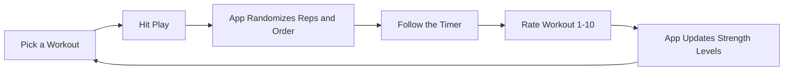

# MadReps

MadReps is a workout timer that handles the planning for you. Instead of doing the same number of reps every time, the app uses math to change your workout every day so you stay challenged without getting bored or burnt out.

## Why use MadReps?

### 1. Less thinking, more moving
Most apps make you log every single set and weight. With MadReps, you only give one number when you finish: a rating from 1 to 10 on how hard the workout felt. The app uses that rating to automatically update your strength levels for the next time. This means you spend less time typing and more time training.

### 2. Variety keeps it interesting
If you always do the same number of reps, you eventually get bored or hit a wall. MadReps uses controlled randomness to pick a different number of reps for every set.
* Some sets will feel a bit easier, giving you a mental break.
* Some sets will feel a bit harder, pushing your limits.
This variety keeps your body guessing and prevents the mental drain of trying to hit a personal best every single day.

### 3. Smart rest periods
The app does not use a flat timer for rest. It calculates your rest periods so you get more recovery time during the toughest parts of the workout and less when you are fresh and just starting.

---

## How it Works

---

## Main Features

* Fresh Workouts: Every time you start, the rep counts and the order of exercises change automatically.
* Auto-Adjustment: Give a score from 1-10 and the app makes the next workout harder or easier for you.
* Simple Timer: A clear screen that tells you what to do, how many reps to perform, and what is coming up next.
* Customization: You can still go in and manually change sets, rest times, or exercises whenever you want.
* Organized Paths: Group your workouts into categories like Jump Rope, Bodyweight, or Strength.

---

## Technical Details (The Formulae)

If you are interested in the math behind the app, here are the calculations used:

### 1. Repetition Calculation
The app looks at your 1-set max ($1s\_max$) and picks a random number within your lower and upper bounds.

$$Reps = randbetween(1s\_max - (lower \cdot 1s\_max), 1s\_max + (upper \cdot 1s\_max))$$

### 2. Rest Between Sets
Rest time ($i$) changes per set using a sine wave so that you get more rest in the middle of the workout.

$$Rest (min) = \lceil rest\_between\_sets \cdot (1 + |\sin(180 \cdot \frac{i}{sets})|) \rceil$$

### 3. Strength Calibration
When you give feedback ($f$) from 1-10, your $1s\_max$ is updated for the next session.

$$New 1s\_max = \lceil \max(1, 1s\_max \cdot \sqrt{\frac{f}{8}}) \rceil$$

---

## Setup and Installation

1. Install: Run `npm install` in your terminal.
2. Run: Run `npm run dev` to start the app.
3. Use: Open `http://localhost:5173` in your browser.

Data Storage: Your workouts and progress are saved in your browser's local storage. No accounts are required to get started.